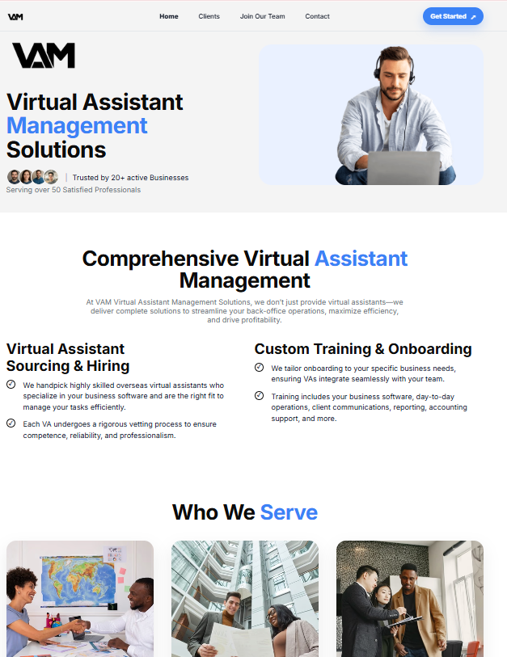

# VAM Website  


Official website for **VAM (Virtual Assistant Management Solutions)**.  
Built as a clean, responsive, Framer-inspired static website to showcase services, onboard clients, recruit talent, and collect inquiries.

---

## 🌐 Live Website
👉 https://vamanage.com

---

## 📸 Preview



---

## 📄 Pages
- **Home** — Company overview and services
- **Clients** — Testimonials and trust indicators
- **Join Our Team** — Job listings and applications
- **Contact** — Contact form (Formspree) and Google Map

---

## 🛠 Tech Stack
- HTML5
- CSS3
- Vanilla JavaScript
- Static hosting (Namecheap)

---

## ✨ Features
- Fully responsive design
- Framer-style spacing and typography
- Client testimonial slider
- Contact form powered by Formspree
- Google Maps embed
- Optimized for performance and SEO

---

## 📂 Project Structure
```text
.
├── index.html
├── clients.html
├── join.html
├── contact.html
├── styles.css
├── script.js
├── assets/
│   ├── images/
│   ├── videos/
│   └── preview.png
├── README.md
└── .gitignore
```

## 🚀 Local Development

You can preview the site by:

- Opening **index.html** directly in your browser

- OR using VS Code Live Server (recommended)


## 🚚 Deployment

This site is deployed on **Namecheap shared hosting.**

## 🔐 License

This project is proprietary and intended for **VAM internal and business use only.**

**All rights reserved © VAM.**
Unauthorized copying, redistribution, or reuse is not permitted.

## 📬 Contact

For business inquiries or access permissions, please contact the VAM team via the website.
